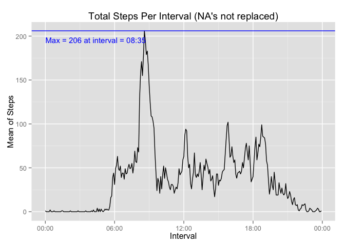
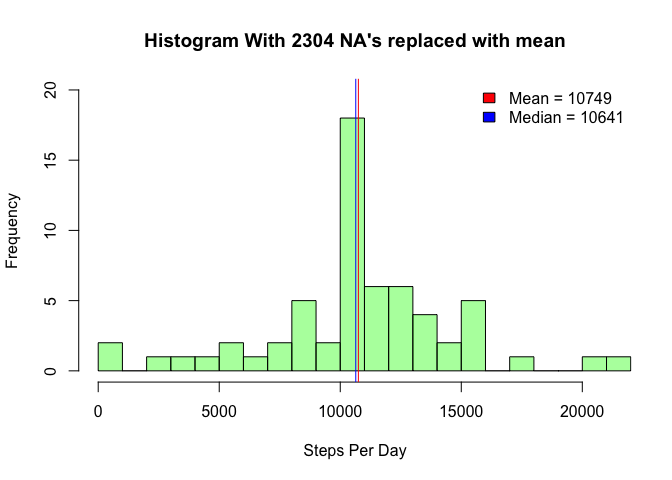

mvonderlieth (Mark von der Lieth)  
December 7, 2014  

# Introduction
This is my submittal for the Programming Assignment 1 for the Reproducible Research Course.
Please see that page for a description of the assignment and data, https://github.com/rdpeng/RepData_PeerAssessment1 .

### Peer Reviewer Notes
First, thanks for the time.
Second, Please note that I included functions in the loading and preprocessing section that I use a lot in all my R projects.
Each section includes functions for that section and then the R code that uses them.
I included some function params so that that caller has some flexibility in output without modifying the functions themselves.
I included all the reporting information in the plots themselves as best I could, vs. outputting to the console, etc.

## Loading and preprocessing the data


```r
# author mvonderlieth
library(dplyr,warn.conflicts = F)
library(tidyr)
library(lubridate)
library(ggplot2)


# main logic is in the main() function at the end of file
## support functions
# plot on screen
plotOnScreen <- function(plotFunction,...) {
    p = plotFunction(...)
    print(p)
    return(p)
}

# plot on screen
justPlot <- function(plotFunction,...) {
    plotFunction(...)
}

## loading and processing functions
# load the full data source into a 'tmp' if not there already,
#  and once it's there, if not test, use full data, else just use sample of the full data.
# Note also storing into globals so that this method can easily be called repetitively.
loadCsvData <- function(zipFile,dataFile,test,testSampleSize) {
    unzip(zipFile)

    if (!exists("FullDataFromSource")) {
        FullDataFromSource <<- read.csv(dataFile)
    }

    # for expolatory phase just test with small data set in case full data set is large
    if (!test) {
        WorkingDataFromSource <<- FullDataFromSource
    } else {
        # try to keep the same sample set
        if (!exists("WorkingDataFromSource_sample")) {
            WorkingDataFromSource_sample <<- FullDataFromSource %>% sample_n(testSampleSize)
            WorkingDataFromSource <<- WorkingDataFromSource_sample
        }
    }
}

# when testing data may not represent full set of data.
# set test to TRUE when exploring data
zipFile = "./activity.zip"

if (file.exists(zipFile)) {
    # load data as globals
    loadCsvData(zipFile,dataFile="./activity.csv",test=FALSE,testSampleSize=1000)
} else {
    stop (paste("The data file",zipFile,"doesn't exist, make sure to set the working directory!"))
}
```


## What is mean total number of steps taken per day?

To answer this, plot a histogram of the steps taken per day and report the mean and median of the total steps taken per day.


```r
# build the data set for steps by day with NA
buildDataPerDay <- function(dataFromSource) {
    d = dataFromSource %>%
        mutate(datePosix=ymd(date)) %>%
        arrange(datePosix) %>%
        group_by(datePosix) %>%
        summarise(stepsTotal = as.integer(sum(steps,na.rm=TRUE)))

    return(d)
}

## analysis plot functions
# plot histogtram of mean total number of steps per day
plotHistMeanStepsPerDay <- function(d, addToTitle = "", numBreaks=10) {
    mn = as.integer(mean(d$stepsTotal, na.rm=TRUE))
    md = as.integer(median(d$stepsTotal, na.rm=TRUE))
    meanText = paste0("Mean = ", mn)
    medianText = paste0("Median = ", md)
    mainText = paste0("Histogram ",addToTitle)
    xmin = min(d$stepsTotal)
    xmax = max(d$stepsTotal)
    xdist = c(xmin,xmax)
    stepsCol = "#0000FF88"

    hist(d$stepsTotal, xlim=xdist, xlab="Steps Per Day", main=mainText, col=stepsCol, ylim=c(0,20), breaks=numBreaks)
    legend("topright", legend=c(meanText,medianText), fill=c("red","blue"), box.lwd = 0, box.col = "red")
    abline(v=c(mn,md),col=c("red","blue"))
}

# build analyis data for mean steps per day and plot
stepsPerDayData <<- buildDataPerDay(WorkingDataFromSource)
numBrks = 10
addToTitleText = paste0("With NA's")
justPlot(plotHistMeanStepsPerDay, stepsPerDayData, addToTitle=addToTitleText, numBreaks=numBrks)
```

 

## What is the average daily activity pattern?

To answer this, create a time series plot of the 5-minute interval along with the interval that has the maximum number of steps.


```r
# build the data set for steps by interval with NA
buildDataPerInterval <- function(dataFromSource) {
    d = dataFromSource %>%
        mutate(datePosix = ymd(date)) %>%
        arrange(interval) %>%
        group_by(interval) %>%
        summarise(meanIntervalSteps = as.integer(mean(steps, na.rm=T)))

    return(d)
}

# plot time series of average daily activity pattern
plotTimeSeriesMeanStepsPerDay <- function(d) {
    mx = max(d$meanIntervalSteps, na.rm = TRUE)
    tmp = d$interval[d$meanIntervalSteps == mx]
    mxInterval = tmp[!is.na(tmp)]
    maxText = paste0("Max = ", as.integer(mx), " at interval = ", mxInterval)
    textMaxX = d$interval[1]
    textMaxY = mx - (mx * .05)

    p = ggplot(d, aes(x=interval, y=meanIntervalSteps)) +
        geom_line() +
        geom_abline(slope = 0, intercept = mx, color = "blue") +
        labs(list(x ="Interval",y ="Mean of Steps", title="Total Steps Per Interval (NA's not replaced)")) +
        annotate("text", label = maxText, x = textMaxX, y = textMaxY, size = 4, colour = "blue", adj = 0)

    return (p)
}

# build analysis data for mean steps per interval and plot
stepsPerIntervalData <<- buildDataPerInterval(WorkingDataFromSource)
p = plotOnScreen(plotTimeSeriesMeanStepsPerDay, stepsPerIntervalData)
```

 

## Imputing missing values

Calculate and report the number of NAs, replace them with a mean of the steps per interval, and plot a histogram as in question 1.

In answer to the question of does this make a difference and does it make an impact, after reviewing both plots,
it does make a bit of difference of course since there are now values for the missing 2000 or so NA's.

But the impact does not seem that significant because of the percentage is NA's medium to small, and there are many
observations where the number of steps is 0, so any mean derived from that will have little impact across the
whole range, noting that it did seem to even out the lower ranges around 0!


```r
# convert with NA replace
convertStepsToNoNAData <- function(dataFromSource,intervalData) {
    d = dataFromSource %>%
        mutate(steps = ifelse(is.na(steps), intervalData$meanIntervalSteps, steps))
    return(d)
}

# build analyis data for imputed missing value and plot
noNAData <<- convertStepsToNoNAData(WorkingDataFromSource,stepsPerIntervalData)
# resuse build and plot functions from above
stepsPerDayNoNAData <<- buildDataPerDay(noNAData)
addToTitleText = paste0("With ",sum(is.na(WorkingDataFromSource$steps))," NA's replaced with mean")
p = justPlot(plotHistMeanStepsPerDay, stepsPerDayNoNAData, addToTitle=addToTitleText, numBreaks=numBrks)
```

 


## Are there differences in activity patterns between weekdays and weekends?

To answer this, create a plot with the dataset from question 3, add factors for weekend and weekday, and plot the the 5-minute intervals in a panel plot.


```r
# append weekend or weekday factor
appendWeekdayWeekendData <- function(dataFromSource) {
    d = dataFromSource %>%
        mutate(weekend = ifelse(wday(date) == 1 | wday(date) == 7,"weekend","weekday"))
    return(d)
}

# build the data set for steps by interval
buildDataPerIntervalWeekend <- function(dataFromSource) {
    d = dataFromSource %>%
        mutate(datePosix = ymd(date)) %>%
        arrange(interval,weekend) %>%
        group_by(interval,weekend) %>%
        summarise(meanIntervalSteps = mean(steps, na.rm=T))

    return(d)
}

# plot time series of activity patterns between weekdays and weekends
plotTimeSeriesWeekend <- function(d) {
    p = ggplot(d, aes(x=interval, y=meanIntervalSteps)) +
        geom_line() +
        facet_grid(weekend ~ .) +
        labs(list(x ="Interval",y ="Mean of Steps", title="Total Steps Per Interval Weekday vs Weekend"))

    return (p)
}

# build analyis data for weekend vs weekday and plot
weekdayWeekendData <<- appendWeekdayWeekendData(WorkingDataFromSource)
weekdayWeekendStepsPerIntervalData <<- buildDataPerIntervalWeekend(weekdayWeekendData)
p = plotOnScreen(plotTimeSeriesWeekend, weekdayWeekendStepsPerIntervalData)
```

 

### Conclusions
